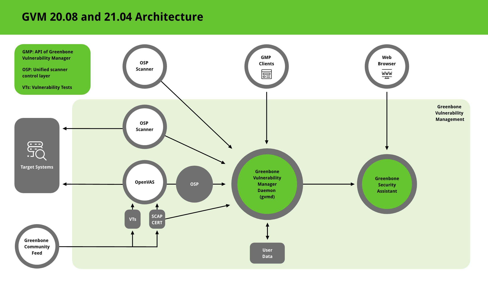
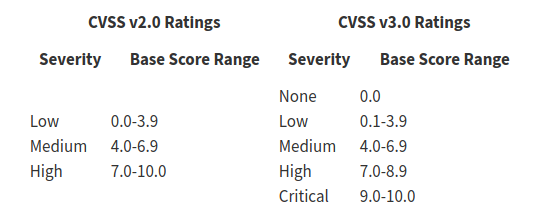
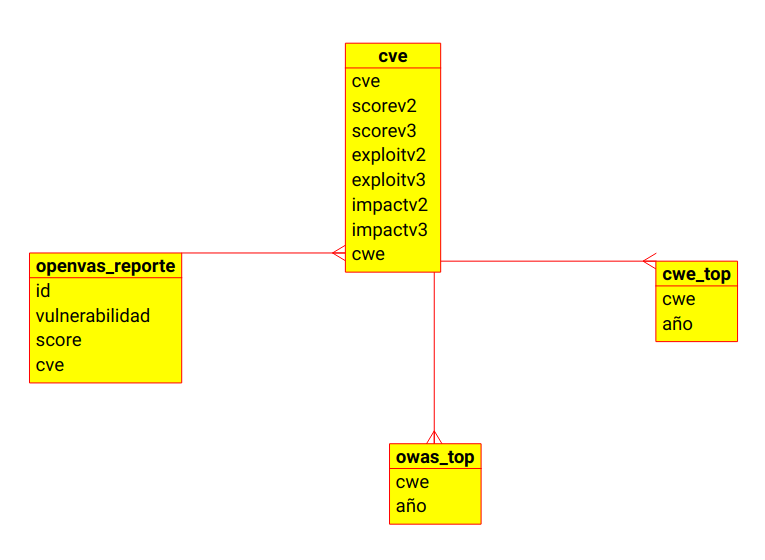

<style>
body {
text-align: justify}
</style>

```{r setup, include=FALSE}
knitr::opts_chunk$set(out.width = '750px', dpi=200, echo = TRUE)
```

```{r, include=FALSE}
sys.source("Main.R", envir = knitr::knit_global())
```
## Objetivo
\
Proponer el uso de Data Science para realizar un análisis de los resultados generados por la herramienta OpenVAS <https://openvas.org/> que ayude a la toma de decisiones en la aplicación de medidas correctivas en los hallazgos realizados
\

## Introducción
\
OpenVAS es una herramienta utilizada para realizar evaluaciones de vulnerabilidades realizando pruebas definidas en sus VT(Vulnerability Test). 
\
\
```{r, echo=FALSE, out.width = '100%'}

```
\
Con las pruebas ejecutadas OpenVAS genera reportes (pdf, xml, html) por cada host analizado con información que incluye desde puertos hasta vulnerabilidades encontradas con sus respectivas referencias dentro de las que se incluyen los reportes **CVE (Common Vulnerabilities and Exposures)**
\
\
Cada CVE registrada es calificada, su severidad, en base a unas métricas **(Common Vulnerability Scoring System)**, en su versión 2 y 3, de vulnerabilidad definidas en la siguientes tablas:
\
\
```{r, echo=FALSE, out.width = '100%'}

```
\
Los framework CVSS son mantenidos por FIRST.Org, Inc. <https://www.first.org/cvss/> una organización no gubernamental en los Estados Unidos de Norteamerica cuya misión es ayudar a los equipos de respuesta de incidentes de seguridad.
\
\
OpenVAS utiliza ,principalmente, las métricas del **CVSSv2** debido a que no todos los CVE, en la actualidad, cuentan con una calificación basada en **CVSSv3**
\

## Planteamiento del problema
\
Sí bien es cierto OpenVAS genera documentos completos y detallados, sobre las vulnerabilidades encontradas,  se presenta un problema cuando es necesario análizar todos los datos generados y sobre todo cuando el número de dispositivos analizados incrementa. La cantidad de información generada ocasiona que exista un trabajo manual y muchas horas de análisis para tener información clara y precisa sobre los resultados obtenidos y por donde deberíamos comenzar para aplicar las medidas correctivas de las vulnerabilidades encontradas.
\

## Propuesta de solución
\
Con la finalidad de plantear una solución que pueda ayudar al análisis de las vulnerabilidades encontradas se ha planteado utilizar, principalmente, 4 fuentes de datos: los reportes de **OpenVAS** en formato **xml** por cada dispositivo analizado, la base de datos de NVD-CVE hasta el año 2021, la lista del top de las vulnerabilidades más críticas de CWE **(Common Weakness Enumeration)** y de OWASP **(Open Web Application Security Project)**. Estas entidades serán la base que se utilizará para la extracción , transformación y presentación del análisis que ha sido parte de este trabajo. 
\
\
```{r, echo=FALSE, out.width = '100%'}

```
\
\
En el desarrollo de este trabajo se ha procesado datos de **46** informes reales generados por OpenVAS e indetificados por un **id** único asignado por la aplicación. Los informes generaron información de **431** vulnerabilidades con diferentes niveles de severidad.
\
\
```{r pressure, echo=FALSE}
plot.severidad
```
\
\
OpenVAS contabiliza las vulnerabilidades en base a los reportes de seguridad que en varios casos incluyen multiples vulnerabilidades y toma la calificación más alta de severidad en estos casos. En nuestro análisis procedimos a desagregar todas las vulnerabilidades por cada registro CVE referenciado. De la misma forma se identificó vulnerabilidades que no cuentan con un registro CVE dentro de sus referencias.
\
\
```{r, echo=FALSE}
plot.pie
```
\
\
En el análisis desarrollado nos hemos centrado en todas las vulnerabilidades que cuenten con un registro CVE ya que su existencia nos ayuda a garantizar que no se trate de falsos positivos. Por esta razón, realizamos una validación de la existencia de los **542** CVE incluídos en los reportes de OpenVAS que se encuentren registrados en la NVD-NIST (National Vulnerability Database). Con esa verificación se descartaron **3** vulnerabilidades encontradas en diferentes informes **(id)**
\
\
```{r, echo=FALSE}
knitr::kable(nocve.diff, caption = "Listado de vulnerabilidades con CVE sin registro en NVD-NIST")
```
\
\
También se realizó la validación de los CVE que no cuentan con una calificación según el framework **CVSSv2**. Con esta validación se realizó el descarte de **1** registro incluído en los reportes de OpenVAS
\
\
```{r, echo=FALSE}
knitr::kable(noscore, caption = "Listado de vulnerabilidades sin registro de score en NVD-NIST")
```
\
\
Con los CVE validados **(538)** se procedió a realizar un análisis comparativo, según las métricas definidas en el framework **CVSSv2**, con la finalidad de identificar, visualmente, la concentración de vulnerabilidades consideradas críticas según su **severidad**, **explotabilidad** e **impacto** que permita focalizar la aplicación de medidas correctivas.
\
\
```{r, echo=FALSE}
p <- barplot(multi, xlab = "Tipo de análisis", ylab = "Vulnerabilidades", main = "Vulnerabilidades x métrica",
                            col = c("#008000","#ffff00","#ff0000"),
                            legend.text = rownames(multi), 
                            args.legend = list(x="right"))
```

```{r, echo=FALSE}
knitr::kable(multi, caption = "Tabla de total de vulnerabilidades por métrica")
```
\
\
También, en el análisis se evidenció que **266** de las **538** vulnerabilidades se encontraban dentro de la lista de las debilidades de software más peligrosas del **Top CWE 2020 (Most Dangerous Software Weaknesses)**
\
\
```{r, echo=FALSE}
plot.cwetop
```
\
\
De la misma forma se evidenció que **160** de las **538** vulnerabilidades se encontraban dentro de la lista de los riesgos de seguridad en aplicaciones web del **OWASP Top Ten 2017 (Web Application Security Risks)**
\
\
```{r, echo=FALSE}
plot.owastop
```
\
\
Finalmente, con la información analizada se propuso una lista con **47** vulnerabilidades incluídas en los **46** informes **(id)** de OpenVAS cuya atención debe ser priorizada debido a la calificación obtenida en las métricas de evaluación del framework **CVSSv2**
\
\
```{r, echo=FALSE}
knitr::kable(highscore, caption = "Listado de vulnerabilidades con prioridad de atención")
```

## Conclusiones

- El uso de herramientas de Data Science como RStudio nos ha permitido procesar, transformar y presentar datos de una manera automatizada en base a los criterios definidos en el trabajo

- La elaboración del presente trabajo nos ha permitido conocer la importancia del Data Science para la reducción de tiempos en los habituales procesos manuales a los que estamos involucrados en las labores de ciberseguridad
\

## Comentarios finales

- El alcance del trabajo ha podido ser mayor debido a la cantidad de datos que se puede procesar, transformar y mostrar pero por razones de tiempo ha sido acotado a esta primera fase en donde se ha querido sentar las bases de lo que se puede hacer en un análisis de este tipo aplicando lo aprendido en clase